# EXPERIMENT - 3b


# Q1)Write an SQL query to create a view named EMP_VIEW that displays all columns from the EMPLOYEES table.
```
CREATE VIEW EMP_VIEW AS
SELECT *
FROM EMPLOYEE;
```
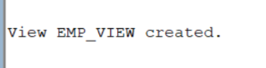


# Q2) Write an SQL query to create a view named EMP_BASIC that displays the Employee ID, First Name, Last Name, Department, and Salary.
```
CREATE VIEW EMP_BASIC AS
SELECT Employee_ID,First_Name,Last_Name,
Department,Salary
FROM EMPLOYEE;
```
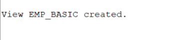


# Q3)Write an SQL query to display all records from the EMP_VIEW.
```
SELECT *
FROM EMP_VIEW;
```


# Q4)Write an SQL query to create a view named IT_EMPLOYEES that displays the details of employees working in the IT department.
```
CREATE VIEW IT_EMPLOYEES AS
SELECT *
FROM EMPLOYEE
WHERE Department = 'IT';
```
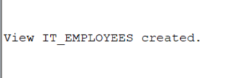


# Q5) Write an SQL query to create a view named HIGH_SALARY that displays employees whose salary is greater than ₹60,000.
```
CREATE VIEW HIGH_SALARY AS
SELECT *
FROM EMPLOYEE
WHERE Salary > 60000;
```
[output](op3b5.png)


# Q6)Write an SQL query to create a view named HYDERABAD_EMP that displays employees whose city is Hyderabad.
```
CREATE VIEW HYDERABAD_EMP AS
SELECT *
FROM EMPLOYEE
WHERE City = 'Hyderabad';
```
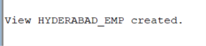


# Q7)Write an SQL query to create a view named FEMALE_EMP that displays the details of all female employees.
```
CREATE VIEW FEMALE_EMP AS
SELECT *
FROM EMPLOYEE
WHERE Gender = 'F';
```
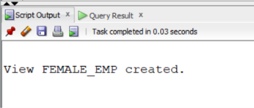


# Q8.Write an SQL query to create a view named RECENT_EMPLOYEES that displays employees hired on or after 01-JAN-2020.
```
CREATE VIEW RECENT_EMPLOYEES AS
SELECT *
FROM EMPLOYEE
WHERE Hire_Date >= TO_DATE('01-JAN-2020', 'DD-MON-YYYY');
```
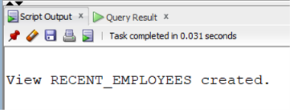


# Q9)Write an SQL query to display the Employee ID, First Name, and Salary from the HIGH_SALARY view.
```
SELECT Employee_ID,First_Name, Salary
FROM HIGH_SALARY;
```
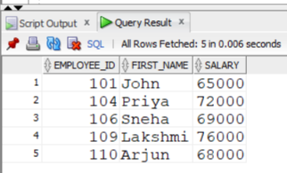


# Q10)Write an SQL query to replace the EMP_BASIC view by adding the CITY column using the CREATE OR REPLACE VIEW statement.
```
CREATE OR REPLACE VIEW EMP_BASIC AS
SELECT Employee_ID,First_Name,Last_Name,
Department,Salary,City
FROM EMPLOYEE;
```
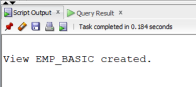


# Q11)Write an SQL query to create a read-only view named EMP_SALARY_VIEW that displays the Employee ID, First Name, Last Name, and Salary.
```
CREATE VIEW EMP_SALARY_VIEW AS
SELECT Employee_ID,
First_Name,Last_Name,Salary
FROM EMPLOYEE
WITH READ ONLY;
```
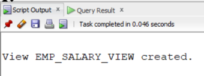


# Q12)Write an SQL query to create a view named SALES_EMP that displays employees belonging to the Sales department using the WITH CHECK OPTION clause.
```
CREATE VIEW SALES_EMP AS
SELECT *
FROM EMPLOYEE
WHERE Department = 'Sales'
WITH CHECK OPTION;
```
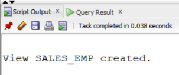


# Q13)Write an SQL query to update the salary of employee 101 through the EMP_BASIC view.
```
UPDATE EMP_BASIC
SET Salary = 70000
WHERE Employee_ID = 101;
```
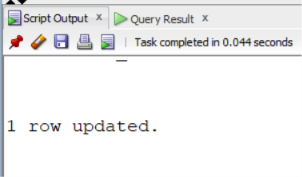


# Q14)Write an SQL query to delete the details of employee 107 through the EMP_VIEW.
```
DELETE FROM EMP_VIEW
WHERE Employee_ID = 107;
```
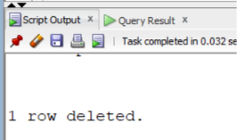


# Q15)Write an SQL query to insert a new employee into the EMP_BASIC view.
```
INSERT INTO EMP_BASIC
VALUES (111, 'Ravi', 'Kumar', 'IT', 65000, 'Hyderabad');
```
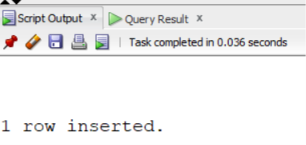


# Q16)Write an SQL query to display the structure of the EMP_BASIC view.
```
DESC EMP_BASIC;
```
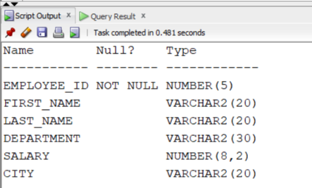


# Q17)Write an SQL query to display all records from the IT_EMPLOYEES view.
```
SELECT *
FROM IT_EMPLOYEES;
```
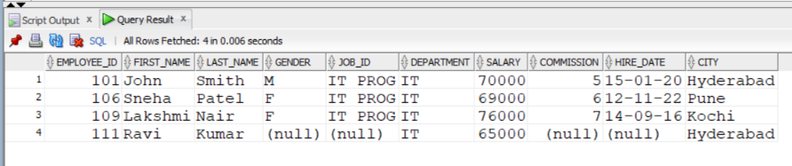


# Q18)Write an SQL query to display employees from the HIGH_SALARY view whose salary is greater than ₹70,000.
```
SELECT *
FROM HIGH_SALARY
WHERE Salary > 70000;
```
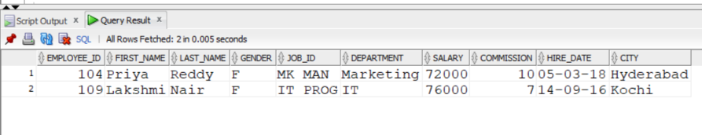


# Q19)Write an SQL query to display all female employees from the FEMALE_EMP view.
```
SELECT *
FROM FEMALE_EMP;
```
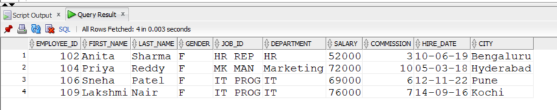


# Q20)Write an SQL query to display the names and salaries of employees from the HYDERABAD_EMP view.
```
SELECT First_Name,Last_Name,Salary
FROM HYDERABAD_EMP;
```
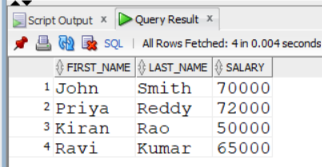


# Q21)Write an SQL query to drop the EMP_VIEW.
```
DROP VIEW EMP_VIEW;
```


# Q22)Write an SQL query to drop the HIGH_SALARY view.
```
DROP VIEW HIGH_SALARY;
```
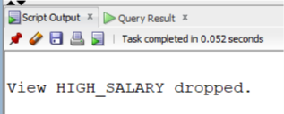


# Q23)Write an SQL query to drop the EMP_BASIC view.
```
DROP VIEW EMP_BASIC;
```
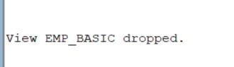


# Q24)Write an SQL query to create a view named HR_EMPLOYEES that displays employees working in the HR department.
```
CREATE VIEW HR_EMPLOYEES AS
SELECT *
FROM EMPLOYEE
WHERE Department = 'HR';
```
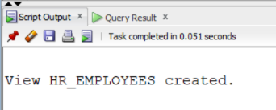


# Q25)Write an SQL query to create a view named MARKETING_EMP that displays the Employee ID, First Name, Department, and Salary of employees working in the Marketing department.
```
CREATE VIEW MARKETING_EMP AS
SELECT Employee_ID,
First_Name,Department,Salary
FROM EMPLOYEE
WHERE Department = 'Marketing';
```
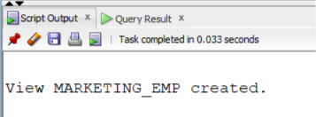


# Q26)Write an SQL query to create a view named TOP_EARNERS that displays employees earning more than ₹70,000.
```
CREATE VIEW TOP_EARNERS AS
SELECT *
FROM EMPLOYEE
WHERE Salary > 70000;
```
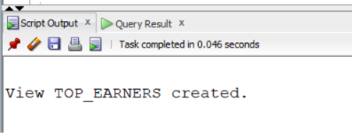


# Q27)Write an SQL query to create a view named EMP_CITY that displays the Employee ID, First Name, Last Name, and City of all employees.
```
CREATE VIEW EMP_CITY AS
SELECT Employee_ID,
First_Name,Last_Name,City
FROM EMPLOYEE;
```
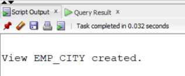


