# EXPERIMENT - 4

# 1)Create a dept table having dno, dname as columns.
```
CREATE TABLE dept (
    dno NUMBER,
    dname VARCHAR2(20)
);
```
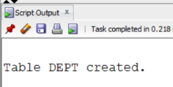


# 2)Apply 'Primary Key Constraint' for dno and NOT NULL Constraint for dname to dept table
```
ALTER TABLE dept
ADD PRIMARY KEY (dno);

ALTER TABLE dept
MODIFY dname VARCHAR2(20) NOT NULL;
```
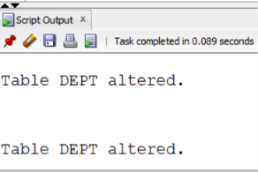


# 3)Create a student table having sid, sname, and did as columns.
```
CREATE TABLE student (
    sid NUMBER,
    sname VARCHAR2(20),
    did NUMBER
);
```


# 4)Apply Primary Key Constraint to sid, NOT NULL Constraint to Sname and Foreign Key Constraint to did refers to dept table
```
ALTER TABLE student
ADD PRIMARY KEY (sid);

ALTER TABLE student
MODIFY sname VARCHAR2(20) NOT NULL;

ALTER TABLE student
ADD FOREIGN KEY (did) REFERENCES dept(dno);
```
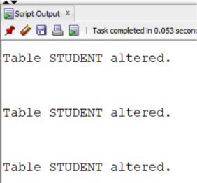


# 5)Insert all department details like cse, me, ce, eee, ece, csm, csd in the dept table.
```
INSERT INTO dept VALUES (1, 'CSE');
INSERT INTO dept VALUES (2, 'ME');
INSERT INTO dept VALUES (3, 'CE');
INSERT INTO dept VALUES (4, 'EEE');
INSERT INTO dept VALUES (5, 'ECE');
INSERT INTO dept VALUES (6, 'CSM');
INSERT INTO dept VALUES (7, 'CSD');
```
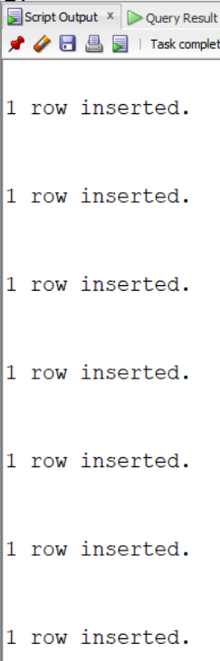


# 6)Insert at least 10 rows in the student table, take values of your own
```
INSERT INTO student VALUES (101, 'Ravi', 1);
INSERT INTO student VALUES (102, 'Anita', 2);
INSERT INTO student VALUES (103, 'Kiran', 3);
INSERT INTO student VALUES (104, 'Priya', 4);
INSERT INTO student VALUES (105, 'Arjun', 5);
INSERT INTO student VALUES (106, 'Sneha', 6);
INSERT INTO student VALUES (107, 'Rahul', 7);
INSERT INTO student VALUES (108, 'Divya', 1);
INSERT INTO student VALUES (109, 'Vijay', 2);
INSERT INTO student VALUES (110, 'Meena', 3);
```

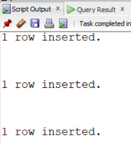


# 7)Write a SQL Query to implement NATURAL JOIN between Student and Dept.
```
SELECT *
FROM student
NATURAL JOIN dept;
```
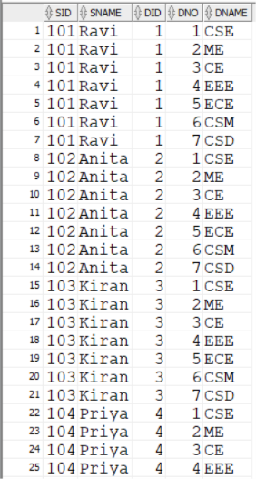
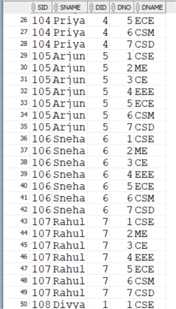
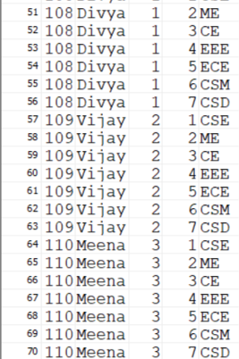


# 8)Write a SQL Query to implement EQUI JOIN between Student and Dept.
```
SELECT *
FROM student, dept
WHERE student.did = dept.dno;
```
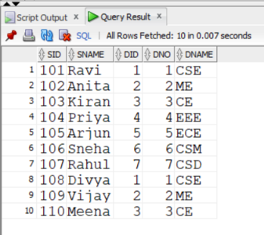


# 9)Write a SQL Query to implement CONDITIONAL JOIN between Student and Dept.
```
SELECT *
FROM student, dept
WHERE student.did > dept.dno;
```


# 10)Write a SQL Query to implement LEFT OUTER NATURAL JOIN between Student and Dept.
```
SELECT *
FROM student
LEFT OUTER JOIN dept
ON student.did = dept.dno;
```
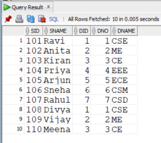


# 11)Write a SQL Query to implement RIGHT OUTER NATURAL JOIN between Student and Dept.
```
SELECT *
FROM student
RIGHT OUTER JOIN dept
ON student.did = dept.dno;
```
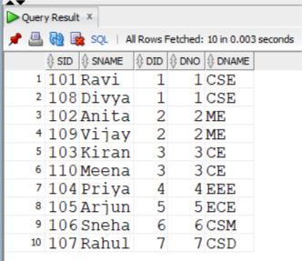


# 12)Write a SQL Query to implement FULL OUTER NATURAL JOIN between Student and Dept.
```
SELECT *
FROM student
FULL OUTER JOIN dept
ON student.did = dept.dno;
```


# 13)Write a SQL Query to implement LEFT OUTER EQUI JOIN between Student and Dept.
```
SELECT *
FROM student
LEFT OUTER JOIN dept
ON student.did = dept.dno;
```


# 14)Write a SQL Query to implement RIGHT OUTER EQUI JOIN between Student and Dept.
```
SELECT *
FROM student
RIGHT OUTER JOIN dept
ON student.did = dept.dno;
```


# 15)Write a SQL Query to implement FULL OUTER EQUI JOIN between Student and Dept.
```
SELECT *
FROM student
FULL OUTER JOIN dept
ON student.did = dept.dno;
```


# 16)Write a SQL Query to implement LEFT OUTER CONDITIONAL JOIN between Student and Dept.
```
SELECT *
FROM student
LEFT OUTER JOIN dept
ON student.did > dept.dno;
```
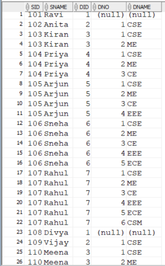


# 17)Write a SQL Query to implement RIGHT OUTER CONDITIONAL JOIN between Student and Dept.
```
SELECT *
FROM student
RIGHT OUTER JOIN dept
ON student.did > dept.dno;
```
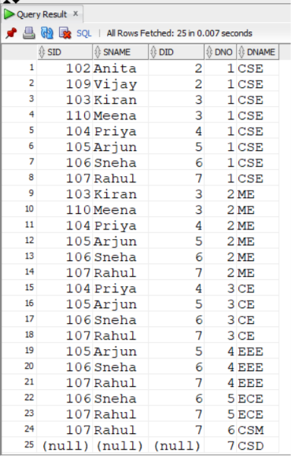


# 18)Write a SQL Query to implement FULL OUTER CONDITIONAL JOIN between Student and Dept.
```
SELECT *
FROM student
FULL OUTER JOIN dept
ON student.did > dept.dno;
```
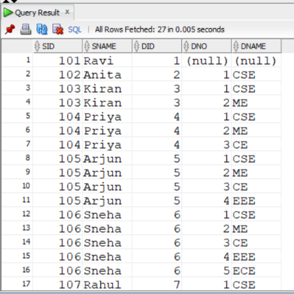
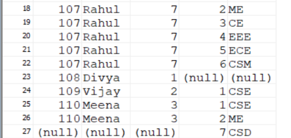


# 19)Write a SQL Query to Implement CROSS JOIN between Student and Dept.
```
SELECT *
FROM student
CROSS JOIN dept;
```


