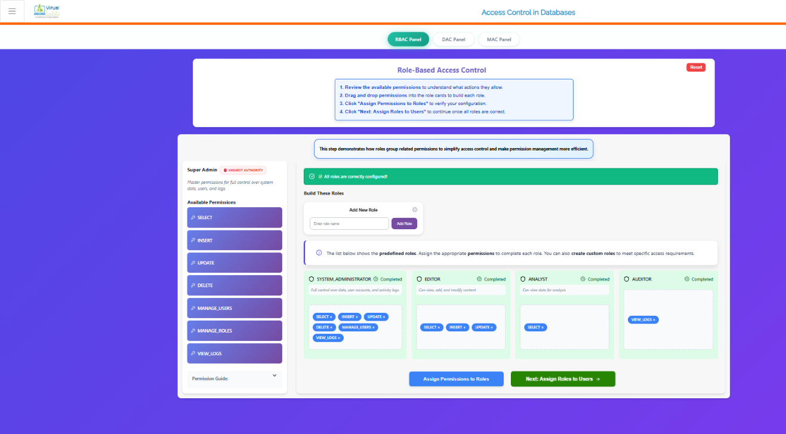
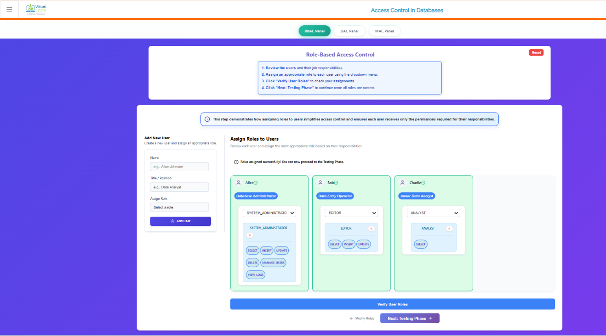
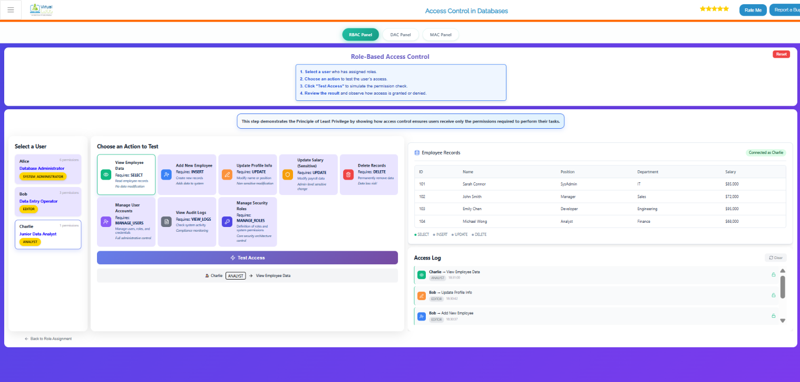
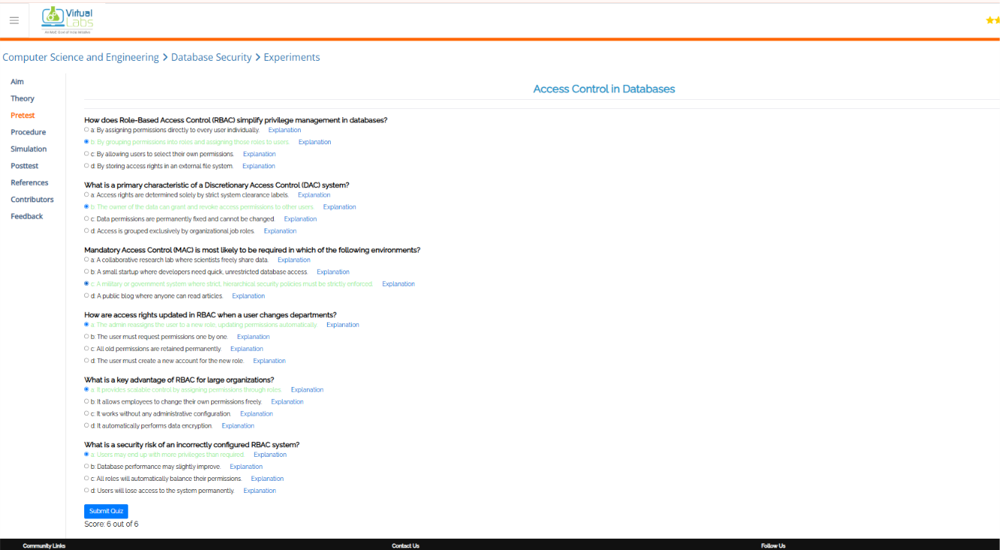
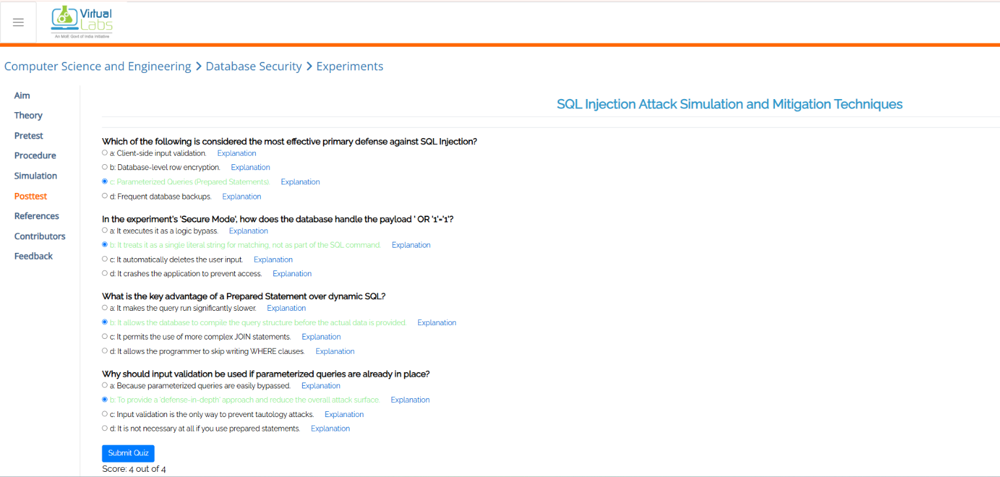
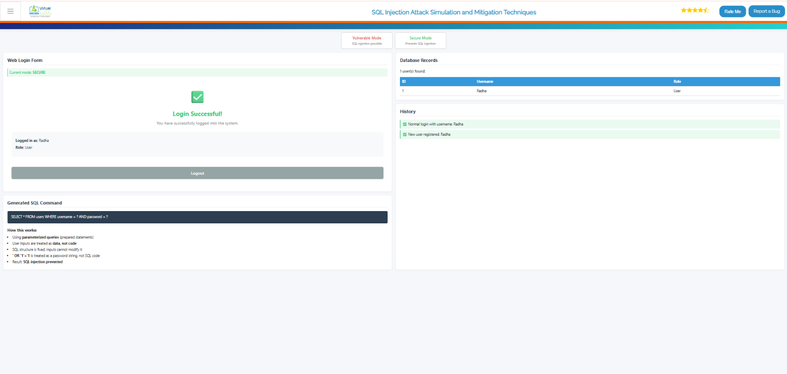
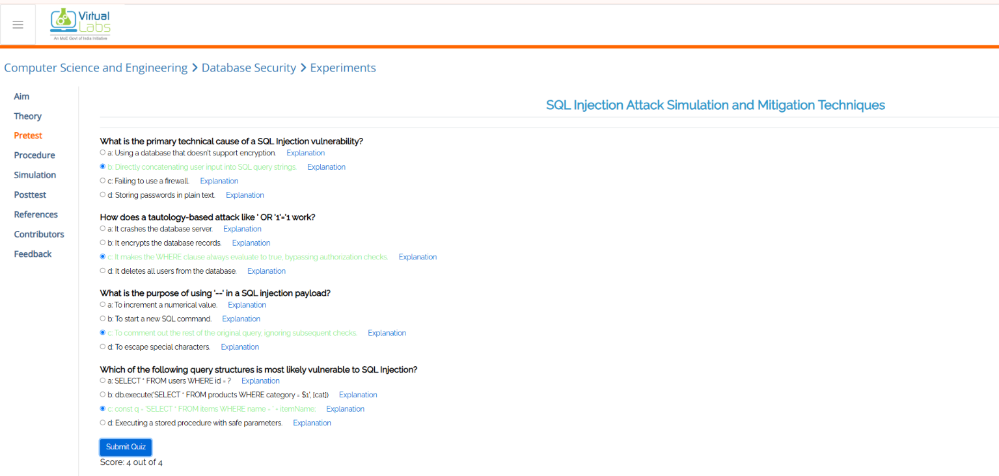

# virtual lab EXPERIMENT - 1,2

# --------------------------------EXPERIMENT - 1----------------------------------
# Postest

# Stimulation

# Pretest

#-----------------------------EXPERIMENT - 2-------------------------------------------

# Postest

# Stimulation

# Pretest

